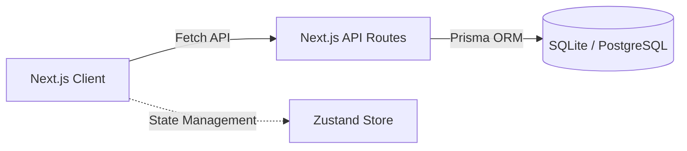

# Mr.Coffee Point of Sale (POS)


<div align="center">
  
  <br/>
  <br/>
  <div style="display: flex; justify-content: center; gap: 20px;">
    
    
  </div>
</div>
<br/>

Aplikasi Point of Sale (POS) / Kasir modern berbasis web dengan **Dark Theme** yang elegan, dirancang untuk mempercepat proses transaksi, manajemen stok, dan pelaporan untuk bisnis retail/F&B skala kecil dan menengah. 

## Daftar Isi

- [Fitur](#fitur)
- [Tech Stack](#tech-stack)
- [Arsitektur](#arsitektur)
- [Struktur Folder](#struktur-folder)
- [Environment Variables](#environment-variables)
- [Instalasi](#instalasi)
- [API Endpoints](#api-endpoints)
- [Catatan](#catatan)

## Fitur

**Kasir (Cashier)**
- Layar POS yang responsif dan dirancang untuk transaksi cepat.
- Pencarian produk.
- Manajemen Keranjang (Cart) menggunakan Zustand (state tersimpan di memori lokal untuk kecepatan).
- Checkout tunai (Cash) dengan kalkulasi kembalian otomatis.
- Validasi stok secara real-time (produk kosong tidak dapat dijual).
- Buka & Tutup Shift kasir.
- Struk cetak (Printable Receipt).

**Admin / Manajer (Upcoming)**
- Dashboard ringkasan penjualan (Total Sales, Total Transaksi).
- Manajemen Produk & Kategori (Tambah, Edit, Nonaktifkan).
- Riwayat Transaksi lengkap.
- Laporan Histori Pergerakan Stok (Inventory Movement).

## Tech Stack

| Layer | Teknologi |
|---|---|
| Frontend | Next.js (App Router), React, Tailwind CSS, shadcn/ui |
| State Management | Zustand |
| Backend | Next.js API Routes (Serverless Functions) |
| Database | SQLite (Dev) / PostgreSQL (Prod) |
| ORM | Prisma Client |

## Arsitektur



## Struktur Folder

```
Point of Sale Aplikasi Kasir/
├── app/
│   ├── api/           # Endpoint API (Backend)
│   ├── admin/         # Halaman Dashboard Admin (WIP)
│   ├── pos/           # Layar Utama Kasir (POS Screen)
│   ├── layout.tsx     # Root layout
│   └── page.tsx       # Root redirect
├── components/        # Reusable UI components (shadcn & kustom)
├── lib/               # Utility functions & inisialisasi Prisma
├── prisma/            # Skema database & script Seeding
├── store/             # Zustand state management (useCartStore)
└── ...
```

## Environment Variables

**`.env`**

| Variable | Keterangan |
|---|---|
| `DATABASE_URL` | Connection string untuk database (Default: `file:./dev.db` untuk SQLite) |

## Instalasi

Prasyarat: Node.js ≥ 18

```bash
# 1. Install dependencies
npm install

# 2. Setup Database Prisma
npx prisma generate
npx prisma db push

# 3. Masukkan Data Dummy (Seed)
npx tsx prisma/seed.ts

# 4. Jalankan Development Server
npm run dev
```

Aplikasi akan berjalan di `http://localhost:3000`.

## API Endpoints

| Method | Endpoint | Keterangan |
|---|---|---|
| GET | `/api/products` | Ambil daftar produk (mendukung query `?search=`) |
| POST | `/api/products` | Tambah produk baru |
| GET | `/api/categories` | Ambil daftar kategori produk |
| POST | `/api/categories` | Tambah kategori baru |
| GET | `/api/transactions` | Ambil riwayat transaksi |
| POST | `/api/transactions` | Buat transaksi baru & potong stok (ACID Transaction) |
| GET | `/api/shifts` | Ambil daftar shift |
| POST | `/api/shifts` | Buka atau tutup shift |

## Catatan

- Untuk mempermudah proses *development* awal (MVP), database saat ini dikonfigurasi menggunakan **SQLite** (file `dev.db`). Jika akan di-*deploy* ke Production, ubah `provider = "sqlite"` menjadi `provider = "postgresql"` di file `prisma/schema.prisma` dan sesuaikan `DATABASE_URL`.
- Autentikasi (Login) saat ini belum diimplementasi penuh; flow transaksi masih menggunakan ID Kasir *dummy* (dapat dilihat pada skrip `CheckoutModal.tsx`).
